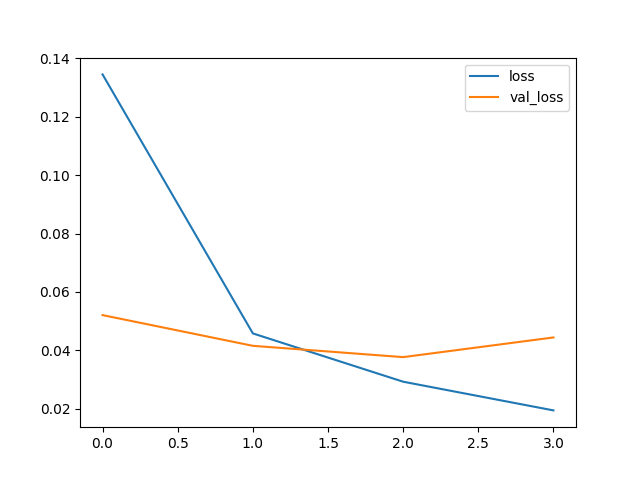
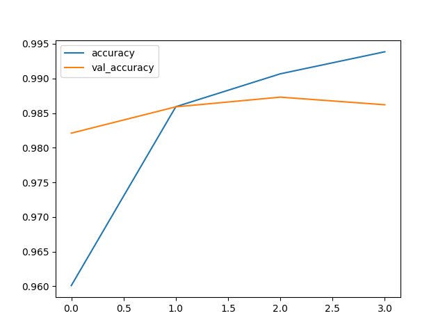
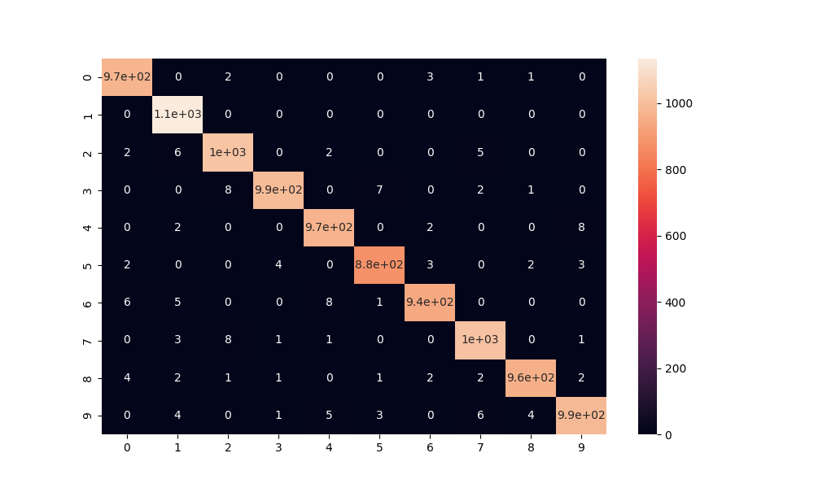

# Mnist Image Model 🤖

> Convolutional neural network that predicts what digit is written on image.
> The model was trained using Mnist dataset.

## Goals

Predict what digit is handwritten on an image:


## Results

### Confusion matrix

```shell
[[ 973    0    2    0    0    0    3    1    1    0]
 [   0 1135    0    0    0    0    0    0    0    0]
 [   2    6 1017    0    2    0    0    5    0    0]
 [   0    0    8  992    0    7    0    2    1    0]
 [   0    2    0    0  970    0    2    0    0    8]
 [   2    0    0    4    0  878    3    0    2    3]
 [   6    5    0    0    8    1  938    0    0    0]
 [   0    3    8    1    1    0    0 1014    0    1]
 [   4    2    1    1    0    1    2    2  959    2]
 [   0    4    0    1    5    3    0    6    4  986]]
```

### Classification report

```shell
              precision    recall  f1-score   support

           0       0.99      0.99      0.99       980
           1       0.98      1.00      0.99      1135
           2       0.98      0.99      0.98      1032
           3       0.99      0.98      0.99      1010
           4       0.98      0.99      0.99       982
           5       0.99      0.98      0.99       892
           6       0.99      0.98      0.98       958
           7       0.98      0.99      0.99      1028
           8       0.99      0.98      0.99       974
           9       0.99      0.98      0.98      1009

    accuracy                           0.99     10000
   macro avg       0.99      0.99      0.99     10000
weighted avg       0.99      0.99      0.99     10000
```

## Exploratory data analysis

### Loss



### Accuracy



### Heatmap Confusion Matrix



## Running

To run the model first create a new Python environment and activate it. I'm using [Anaconda](https://www.anaconda.com/) for setting the python version that pipenv should use to set up the environment. The command bellow will automatically setup the environment with conda and pipenv:

```shell
make env
```

Now install all the project dependencies:

```shell
make install-all
```

And run the model:

```shell
make model
```

> [!WARNING]
> Dont run `make model` without deleting `storage/mnist-image-model.keras`, this will
> cause train/test data over fitting.

After running you model, it will be saved inside `storage/mnist-image-model.keras`.
To just run your recent created model and predict a random value from our data set,
use the following script:

```shell
make predict 
```

> [!WARNING]
> In case you have deleted the `storage/mnist-image-model.keras`, remember that to get `make predict` working you need to run `make model` first to create it.

To run TensorBoard with the latest created version of the model within this
repository run:

```shell
make board
```
